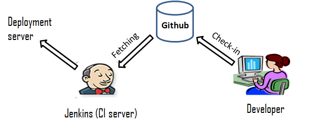

# Automated Web Development Environment

Directory "Website" consists of all the files of the Website that I used for creating a Web Development Environment by interating Git/Github, Jenkins and apache Web Server in ubuntu. I have written a well documented article in my LinkedIn Handle explaining how we can create an web development environment using these technologies.
  
Note : The website used in this, is a demo website downloaded from <a href="https://trendytheme.net/best-free-html-resume-templates-to-download/">here.</a>
